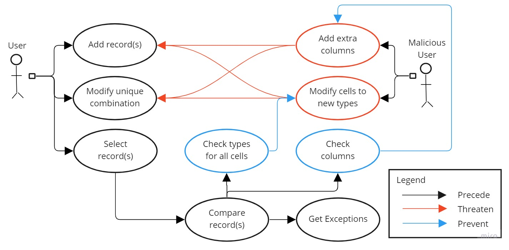

# 50003_testing_campaign
Software Testing Mini Campaign for SUTD course 50.003 Element of Software Construction.

Name: Ho Rui En
Student ID: 1005000

## Usage
The following compares two csv files and returns records that do not match.

### Java only
First command is to compile, second is to run. \
Syntax: `java -cp build/ CompareRecords [csv-path-1] [csv-path-2] [output-path]`
```
javac -d build src/main/java/*.java
java -cp build/ CompareRecords ./assets/sample_file_1.csv ./assets/sample_file_3.csv res.csv
```

### Maven
```
mvn compile # compile
mvn exec:java -Dexec.mainClass="CompareRecords" # execute
```

## Use Case Diagram
<div align="center">
    
</div>

## Equivalence Class Partitioning and Boundary Value Analysis
| Requirement | Equivalence classes |
| ------------------ |:--------------------------------------------- |
| Take two csv files | 1. Is CSV file / Is not CSV file |
| Files contain list of records | 1. Is valid record / Is not valid record |
| All records contains valid customer ID | 1. First value in row is string / First value in row is not a string <br> 2. String is of form "IDx" where x is a positive integer / String is not of form "IDx" |
| All records contains valid account no | 1. Second value in row is string / Second value in row is not a string <br> 2. String is of form "BOSx" where x is a positive integer / String is not of form "BOSx" |
| All records contains valid currency | 1. Third value in row is string / Third value in row is not a string <br> 2. String value is of a valid currency ticker / String is not of valid currency ticker |
| All records contains valid type | 1. Fourth value in row is string / Fourth value in row is not a string <br> 2. String value is in {"CURRENT", "SAVINGS"} / String is not in {"CURRENT", "SAVINGS"} |
| All records contains valid balance | 1. Fifth value in row is positive integer / Fifth value in row is not a positive integer |
